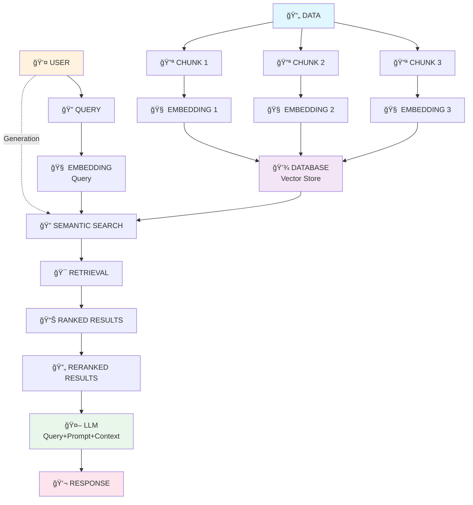

# RAG-Fundamentals 🚀

> **Comprehensive Collection of Retrieval-Augmented Generation Techniques**

A complete hands-on guide to RAG implementations, from basic concepts to advanced techniques. This repository contains practical notebooks demonstrating various RAG approaches, retrieval strategies, and optimization methods.

## 📊 RAG Architecture Flowchart

Based on the provided flowchart, here's the complete RAG system architecture:

### Core RAG Components:
1. **📄 Data Processing**: Documents are split into manageable chunks
2. **🧠 Embedding**: Text chunks converted to vector representations  
3. **💾 Vector Database**: Stores embeddings for efficient retrieval
4. **🔍 Semantic Search**: Finds relevant chunks using similarity
5. **🎯 Retrieval**: Returns top-k most relevant documents
6. **🔄 Reranking**: Optimizes order for better context
7. **🤖 LLM Generation**: Produces final answer with retrieved context

## 🎯 What is RAG?

**Retrieval-Augmented Generation** combines the power of:
- **🔍 Information Retrieval**: Finding relevant external knowledge
- **🤖 Language Generation**: Creating contextual responses
- **📚 External Knowledge**: Up-to-date, domain-specific information

## 📁 Repository Structure

### 🔰 [Basic RAG](./Basic%20Rag/)
**Foundation techniques for RAG implementation**

| Notebook | Purpose | Key Techniques |
|----------|---------|----------------|
| `basic_rag.ipynb` | Core RAG pipeline | Vector embeddings, semantic search, prompt engineering |
| `document_rag.ipynb` | PDF document processing | Local knowledge base, metadata handling |
| `url_rag.ipynb` | Web content RAG | Real-time retrieval, dynamic knowledge updates |

### 🔍 [Retriever Techniques](./Retriever%20Techniques/)
**Advanced retrieval strategies beyond basic semantic search**

| Technique | Notebook | Innovation |
|-----------|----------|------------|
| **Contextual Compression** | `Contextual_Compression_Retriever.ipynb` | Compresses retrieved docs to extract only relevant portions |
| **HyDE** | `Hypothetical_Document_Embedding_(HyDE).ipynb` | Generates hypothetical answers to improve retrieval accuracy |
| **Multi-Hop Retrieval** | `MultiHop_Query_Step_by_Step_Retrieval.ipynb` | Step-by-step retrieval for complex queries |
| **Parent Document** | `Parent_Document_Retriever.ipynb` | Retrieves small chunks but returns larger parent documents |
| **Self-Query** | `Self_Query_Retrieval.ipynb` | Natural language query parsing with metadata filtering |
| **Sentence Window** | `Sentence_Window_Retrieval.ipynb` | Expanded context windows around relevant sentences |

### 🏆 [ReRanking Techniques](./ReRanking%20Techniques/)
**Optimize retrieved document ordering for better LLM performance**

| Method | Notebook | Advantage |
|--------|----------|-----------|
| **BM25 Rerank** | `bm25_rerank_rag.ipynb` | Statistical keyword-based relevance scoring |
| **Cohere Rerank** | `cohere_rerank.ipynb` | State-of-the-art neural reranking API |
| **Cross-Encoder** | `cross_encoder_rerank.ipynb` | Joint query-document encoding for precise relevance |
| **Flash ReRank** | `Flash_ReRanking.ipynb` | Ultra-fast reranking for real-time applications |

### 🔗 [Hybrid Search RAG](./HybridSearch%20Rag/)
**Combine multiple search methodologies for superior performance**

| Technique | Notebook | Combines |
|-----------|----------|----------|
| **Cosine Similarity** | `cosine.ipynb` | Vector similarity mathematics and optimization |
| **Hybrid Search** | `hybridsearch-rag.ipynb` | Semantic + keyword search with score fusion algorithms |

### ⚡ [RAG Fusion](./Rag%20Fusion/)
**Fuse multiple retrieval methods for comprehensive results**

| Method | Notebook | Fusion Strategy |
|--------|----------|-----------------|
| **Reciprocal Rank Fusion** | `ReciProcal_Rank_Fusion.ipynb` | Combines rankings from multiple retrievers using RRF algorithm |

### 🎯 [Lost In Middle Problem](./Lost%20In%20Middle%20Rag%20Problem/)
**Solve positional bias where important info gets overlooked in middle context**

| Solution | Notebook | Approach |
|----------|----------|----------|
| **Merger & Reranking** | `MergerRetriever_And_Reranking.ipynb` | Strategic document ordering and context reorganization |

## 🔧 Key Technologies Used

- **🦜 LangChain**: RAG framework and components
- **🤗 HuggingFace**: Embeddings and transformers
- **📊 ChromaDB**: Vector database storage
- **🔍 FAISS**: Efficient similarity search
- **🌐 OpenAI**: Embeddings and language models
- **⚡ Cohere**: Professional reranking services

## 🚀 Getting Started

1. **Clone the repository**
2. **Install dependencies**: `pip install -r requirements.txt`
3. **Start with Basic RAG** to understand fundamentals
4. **Explore Advanced Techniques** based on your use case
5. **Implement ReRanking** for better accuracy
6. **Try Hybrid Approaches** for production systems

## 💡 Best Practices

- **🎯 Start Simple**: Begin with basic RAG before advanced techniques
- **📊 Measure Performance**: Use relevant metrics for your domain  
- **🔄 Iterate**: Combine multiple techniques for optimal results
- **⚡ Optimize**: Balance accuracy with speed for production
- **📚 Domain-Specific**: Adapt techniques to your specific use case

## 🎯 Use Cases Covered

- **📖 Document Q&A**: Academic papers, legal documents
- **🌐 Web Search**: Real-time information retrieval
- **🏢 Enterprise**: Knowledge management systems
- **🔬 Research**: Multi-document analysis and synthesis
- **💬 Chatbots**: Context-aware conversational AI

---

> **🎯 Master RAG**: From basic retrieval to advanced fusion techniques, this repository provides everything needed to build Development-ready RAG systems.
