# RAG Supervisor Agent

A LangChain + LangGraph demo that answers questions by intelligently switching between three knowledge domains—academic research, encyclopedic facts, and fresh blog content—while caching everything it touches in separate vector stores for lightning-fast reuse.

## ✨ Key Highlights

- **Supervisor Agent**: Classifies each query (research / general / blogs) and routes it through the correct data path.
- **Three Dedicated Vector Stores**:
  - `research_vectorstore` – academic papers (arXiv)
  - `general_vectorstore` – Wikipedia articles  
  - `blogs_vectorstore` – Tavily (news / blogs)
- **Automatic Caching**: If relevant chunks already live in a vector store, the agent skips external calls and answers immediately.
- **RAG Pipeline**: Retrieved chunks feed a Groq-hosted Llama-3 model to generate grounded answers.
- **LangGraph Workflow**: Nodes represent functional steps; edges encode the decision logic.
- **Colab-Ready**: One-cell installation block; just drop your API keys and press ▶️.
- **Typed & Safe**: Pydantic schema enforces correct message formats end-to-end.

## 🏗️ How It Works

1. **User Question** → enters the graph as `state["query"]`.

2. **supervisor_node**
   - LLM classifies the query (research|general|blogs).
   - Peeks into the matching vector store (k = 1).
   - Decides to retrieve now or search external source.

3. **search_*_node** (only on cache miss)
   - Calls ArXiv / Wikipedia / Tavily.
   - Splits text, stores chunks in the proper vector DB.

4. **retrieve_from_vectorstore_node**
   - Pulls top-k chunks (default = 3).

5. **generate_answer_node**
   - Builds a RAG prompt with the chunks.
   - Groq Llama-3 writes the final answer.

6. **Result** → returned to the user and saved in the conversation history.

## 🔄 Workflow Diagram

```mermaid
flowchart TD
    A([START])
    subgraph Classification_Routing ["Classification & Routing"]
        B[supervisor_node<br/>• classify query<br/>• mini-search cache<br/>• set next_action]
    end
    subgraph External_Searches ["External Searches"]
        C1[search_research_node<br/>arXiv → store → chunks]
        C2[search_general_node<br/>Wikipedia → store → chunks]
        C3[search_blogs_node<br/>Tavily → store → chunks]
    end
    D[retrieve_from_vectorstore_node<br/>top-k chunks]
    E[generate_answer_node<br/>Groq LLM + context → answer]
    F([END])

    A --> B
    B -->|"search_research"| C1
    B -->|"search_general"| C2
    B -->|"search_blogs"| C3
    B -->|"retrieve_from_vectorstore"| D
    C1 --> D
    C2 --> D
    C3 --> D
    D --> E --> F
```



## 🚀 Quick Start

### Prerequisites

```bash
pip install langchain langchain_groq langchain-chroma sentence-transformers langgraph langchain_community arxiv tavily-python chromadb wikipedia langchain_tavily
```

### API Keys Required

- **GROQ_API_KEY**: For the Llama-3.3-70b-versatile model
- **TAVILY_API_KEY**: For web search and blog content

### Usage Example

```python
# Initialize the supervisor RAG system
research_answer = query_supervisor_rag("What are the latest developments in transformer neural networks?")
print("Research Answer:", research_answer)

general_answer = query_supervisor_rag("What is One Piece in General?")
print("General Answer:", general_answer)

blog_answer = query_supervisor_rag("What are the latest trends in artificial intelligence?")
print("Blog Answer:", blog_answer)
```

## 📊 System Architecture

### State Management
The system uses a `SupervisorState` TypedDict that tracks:
- **messages**: Conversation history
- **query**: Current user question
- **query_type**: Classification result with confidence
- **search_results**: External search results
- **retrieved_documents**: Vector store retrievals
- **final_answer**: Generated response
- **next_action**: Workflow routing decision

### Query Classification
Uses a structured Pydantic model (`QueryType`) to classify queries:
```python
class QueryType(BaseModel):
    category: Literal["research", "general", "blogs"]
    confidence: float  # 0-1 confidence score
```

### Vector Stores
Three separate Chroma vector databases with persistence:
- **Research**: `./research_vectorstore` - Academic papers from arXiv
- **General**: `./general_vectorstore` - Wikipedia articles
- **Blogs**: `./blogs_vectorstore` - Current events from Tavily

### Text Processing
- **Chunk Size**: 1000 characters
- **Overlap**: 200 characters
- **Embeddings**: SentenceTransformers all-MiniLM-L6-v2
- **Retrieval**: Top-3 similarity search

## 🎯 Use Cases

### Research Queries
- "Latest developments in transformer neural networks"
- "Recent advances in retrieval augmented generation"
- "New findings in quantum computing research"

### General Knowledge
- "What is One Piece?"
- "History of artificial intelligence"
- "How does photosynthesis work?"

### Current Events & Blogs
- "Latest trends in artificial intelligence"
- "Recent tech industry news"
- "Current market analysis"


## 📝 File Structure

```
Supervior Agent RAG/
├── SuperVisor_RAG_Agent.ipynb    # Main implementation
├── README.md                     # This file
├── research_vectorstore/         # Academic papers cache
├── general_vectorstore/          # Wikipedia cache
└── blogs_vectorstore/           # Blog articles cache
```
